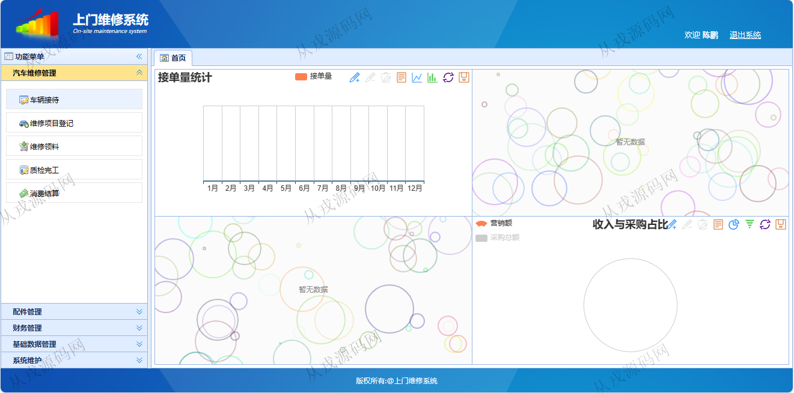
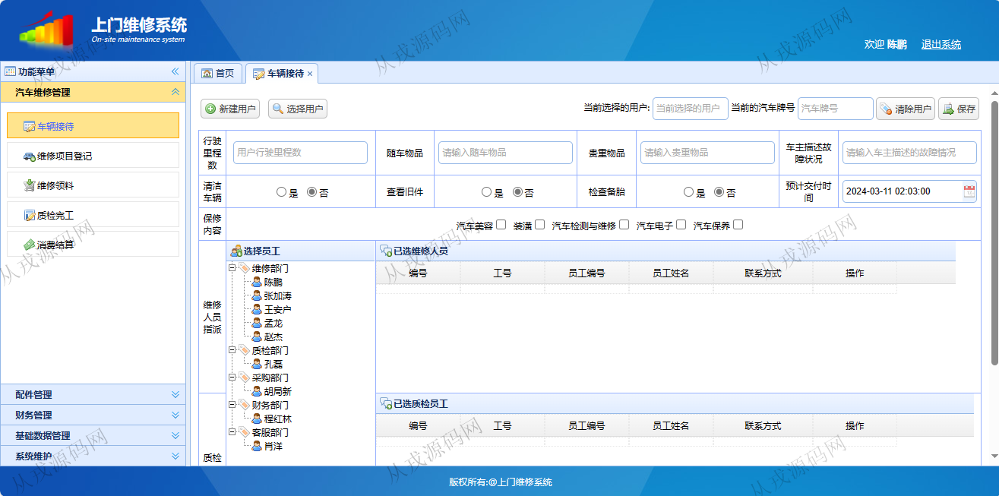
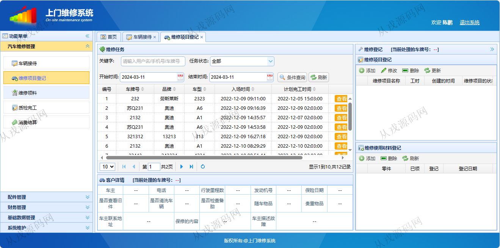
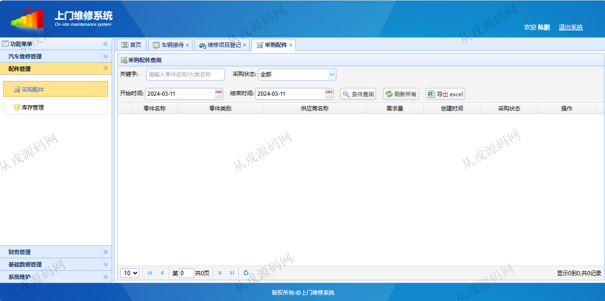
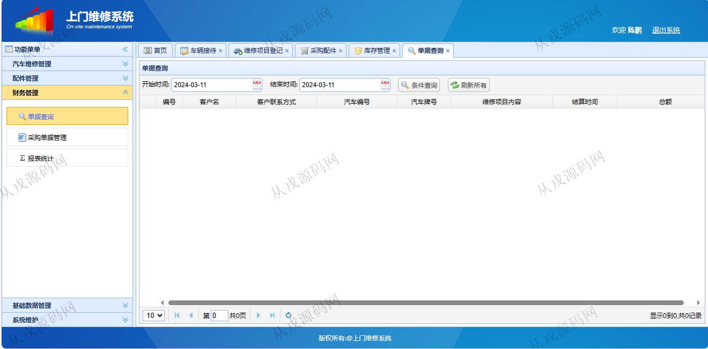
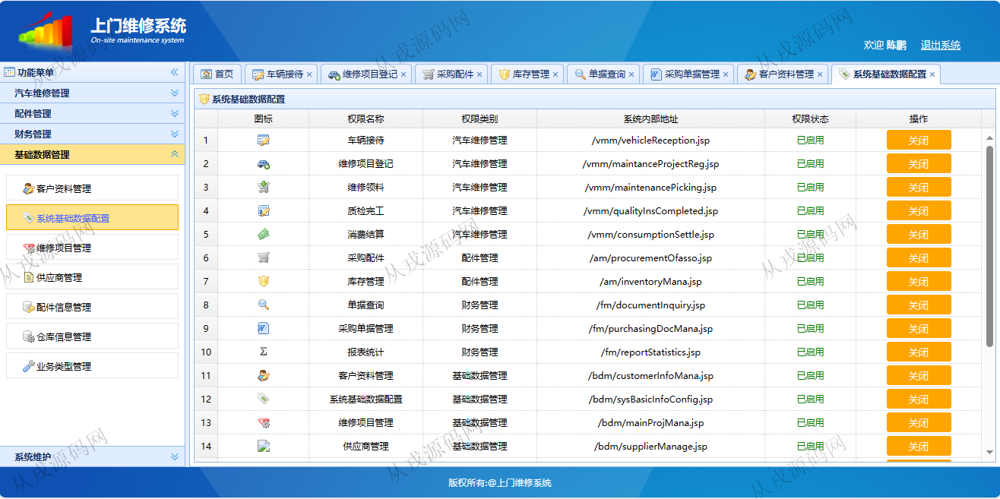
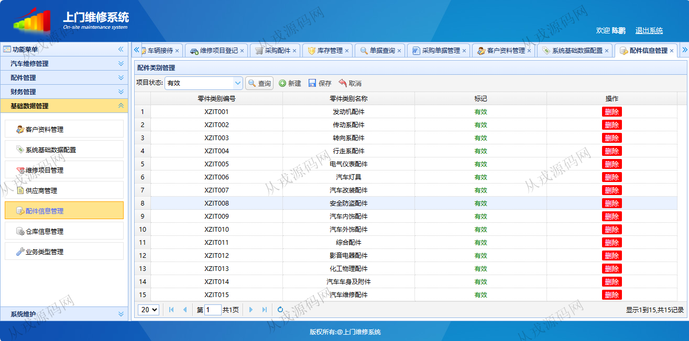
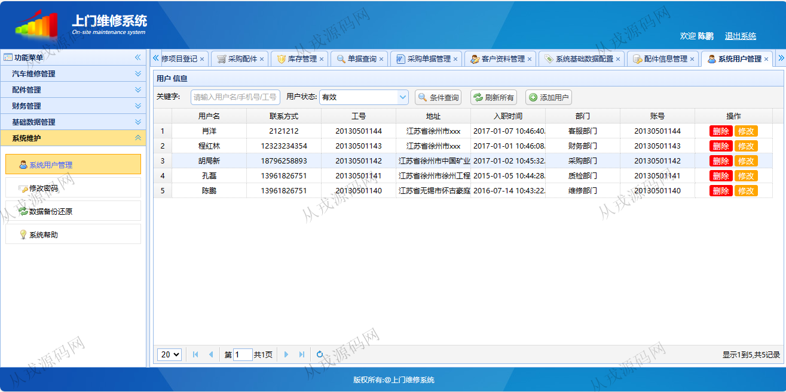

<h1 align="center">227.上门维修管理系统</h1>

- <b>完整代码获取地址：从戎源码网 ([https://armycodes.com/](https://armycodes.com/))</b>
- <b>技术探讨、资料分享，请加QQ群：692619798</b> 
- <b>作者微信：19941326836  QQ：952045282</b> 
- <b>承接计算机毕业设计、Java毕业设计、Python毕业设计、深度学习、机器学习</b>
- <b>选题+开题报告+任务书+程序定制+安装调试+论文+答辩ppt 一条龙服务</b>
- <b>所有选题地址 ([https://github.com/YuLin-Coder/AllProjectCatalog](https://github.com/YuLin-Coder/AllProjectCatalog)) </b>

## 项目介绍
基于ssm的上门维修管理系统：前端 jsp、jquery，后端 maven、springmvc、spring、mybatis；角色分为管理员、用户；集成汽车维修管理、配件管理、财务管理、基础数据管理以及系统的维护等功能于一体的系统。

## 功能介绍

- 车辆接待：系统需要实现添加来访者以及其车辆的信息，需要进行开单操作，同时为维修单分配维修人员和质检人员。
- 维修项目登记：维修人员登录系统能够看到自己当前所有的维修任务，进行维修检查，系统需要纪录维修人员填写的维修项目以及工时和维修领料的情况。
- 维修领料：按照维修人员的相关信息和时间范围的条件,查询用户维修用料登记的情况，可以查看每一项登记的领取历史，对于材料库存不够的情况,需要进行材料采购的申请。
- 质检完工：质检员查看自己的质检任务，进行质检，录入质检结果到系统中。
- 消费结算：车主在约定的时间进行提车，查看维修单，进行付款操作。
- 配件管理：管理配件的信息，采购相关的配件，录入信息到系统中。
- 基础数据管理：对系统的一些参数进行配置，管理系统的一些基础的数据，个人信息的查看以及密码修改等相关功能的实现。

## 环境

- <b>IntelliJ IDEA 2021.3</b>

- <b>Mysql 5.7.26</b>

- <b>Tomcat 7.0.73</b>

- <b>JDK 1.8</b>

## 运行截图

